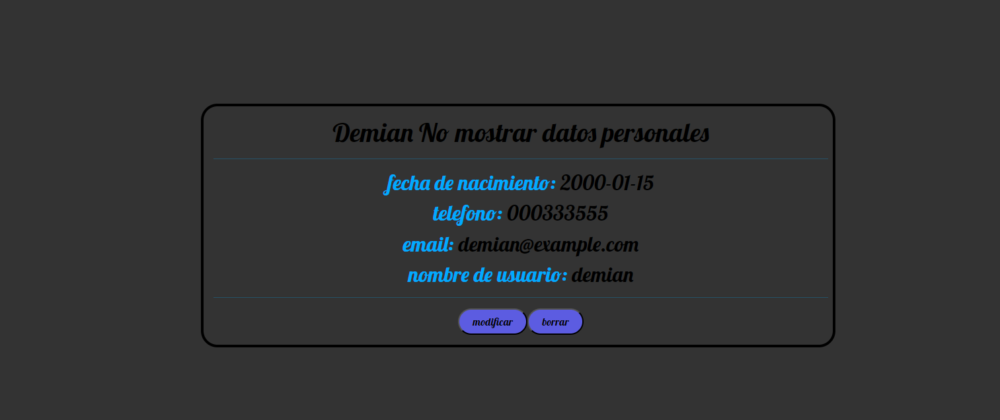

# HOOLIGANS-RIDERS

Es un proeyecto de una pagina web motera , que sobre todo busca que los moteros se apunten, que hagan quedadas y mucho mas.
es facil de utilizar y muy intuitivo:

el proyecto se ha creado con VITE y REACT aparte se han utilizado las siguentes technologias : REACT-BOOTSTRAP , SCSS , DATEPICKER.

paso 1 

el boton principal de Login y los botones a diferentes redes sociales (facebook , instagram , tiktok y youtube).

{:width="400px"}

paso 2

una vez dentro de login, puedes iniciar session con email o con nombre de usuario segun elección , si no tienes cuenta, te puedes registrar desde la barra de navegación de arriba, o volver a la pagina principal dandole click en el nombre de la pagina.

{:width="400px"}

paso 3

registro de nuevos usuario en la pagina, con un diseño simple e intuitivo, los datos no muy personales y dificil de equivocarse ya que cuenta con un sistema de errores para los datos sean buenos.

{:width="400px"}

paso 4

una vez registrado o logueado te manda a la pagina principal logueado con un mensaje de bienvenida y tu nombre de usuario, aparte del menu, donde ahora se puede acceder a la galeria , eventos , mi perfil , contacto y el log out.

{:width="400px"}

paso 5

en el paso 5 tenemos el perfil de cada usuario, en este caso el tuyo , donde se muestra casi todos los datos del usuario, excepto algunos en concreto que no se deben mostrar
Tambien se pueden modificar los datos o borrar la cuenta que consta con una confirmación.

{:width="400px"}

paso 6

te puedes apuntar a los eventos que son creados por otros usuarios con otros roles o desapuntarte,donde se muestra en caso de existencia una foto de que sitio se va a visitar y el punto donde se van a encontrar (llamado maps).

{:width="400px"}